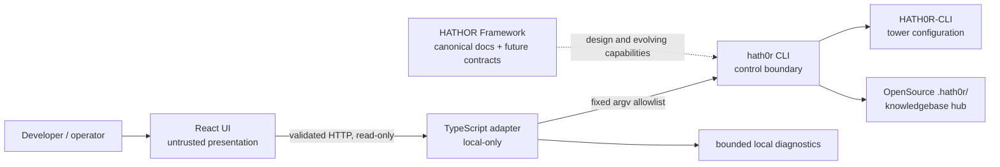

# HATHOR Integration Console POC Architecture

## 1. Decision status

This document defines the proposed product architecture. No application
components shown here exist until implemented by an issue-backed scaffold
change.

The design applies HATHOR's application/framework boundary without importing
older hidden-root or binary examples from design-stage papers. For this
OpenSource product:

- the public operator binary is `hath0r`;
- HATHOR metadata uses `.hath0r/`; and
- `HATH0R-CLI` is the control tower.

## 2. Architectural objective

Give a browser user a useful view of HATHOR status without granting the
browser filesystem, subprocess, credential, policy, or deployment authority.

The POC therefore uses a backend-for-frontend adapter:



## 3. Components

### 3.1 React client

Responsibilities:

- render overview, products, diagnostics, and about routes;
- validate API payloads before use;
- show data source and freshness;
- preserve usable navigation during degraded states; and
- avoid secrets, local path assumptions, and process behavior.

The client has no HATHOR SDK and no direct CLI access.

### 3.2 TypeScript adapter

Responsibilities:

- expose a small read-only HTTP API;
- map named operations to fixed `hath0r` argv arrays;
- enforce timeout, byte, concurrency, and environment limits;
- normalize success, degraded, unavailable, timeout, and invalid-output states;
- redact diagnostic output; and
- emit request-scoped audit metadata.

The adapter is a DMZ, not a policy engine. It may translate a CLI result into
a web response, but it must not decide that a failed HATHOR check passed.

### 3.3 HATHOR CLI

The current executable authority for:

- version discovery;
- group and control-tower diagnostics;
- canonical KB path discovery; and
- suite product-catalog output.

Implemented behavior is determined by
`../../HATH0R-CLI/src/hath0r_cli/cli.py`.

### 3.4 HATHOR Framework

The Framework sibling owns canonical architecture, requirements, principles,
and developer guidance. It is currently a design/documentation source rather
than an application library linked into React.

Future capabilities should enter this POC only after the OpenSource CLI
exposes a versioned contract.

### 3.5 Control tower and knowledge hub

`HATH0R-CLI` owns suite orientation. The canonical KB lives at the group hub,
while this repository's local KB directory remains a pointer.

The adapter asks the CLI for orientation; it does not recalculate tower or KB
authority from arbitrary browser input.

## 4. Trust boundaries

| Boundary | Input trust | Required control |
|----------|-------------|------------------|
| Browser → API | Untrusted | Route/method allowlist, schema validation, no command input |
| API → CLI | Semi-trusted application code | Fixed executable and argv, no shell, timeout, output cap |
| CLI → filesystem/config | CLI authority | Existing CLI checks and path resolution |
| CLI → KB | Group-governed | Hub path through CLI; member stub remains pointer-only |
| Diagnostics → browser | Sensitive local context | Redaction and least-detail response |
| Fixture mode → user | Synthetic | Persistent, non-dismissible source label |

## 5. Request flow

For a status request:

1. React requests `GET /api/hathor/status`.
2. The API assigns a request ID.
3. The adapter executes approved probes with fixed argv:
   - `hath0r --version`;
   - `hath0r doctor`;
   - `hath0r kb path`.
4. Each process runs with a deadline and bounded output.
5. Exit status is authoritative; human-formatted output is diagnostic only.
6. The adapter redacts local details and returns a versioned response.
7. React validates the response and labels its source/freshness.
8. Failure in one probe does not fabricate success for another.

## 6. Proposed API contract

Every response should use one envelope:

```ts
type ApiState = "ok" | "degraded" | "unavailable" | "error";

interface ApiEnvelope<T> {
  schema: "hathor-poc.response/1";
  requestId: string;
  generatedAt: string;
  source: "live-cli" | "fixture" | "application";
  state: ApiState;
  data: T | null;
  diagnostics: Array<{
    code: string;
    message: string;
    remediation?: string;
  }>;
}
```

Rules:

- `state: ok` requires the operation's required probes to succeed.
- `fixture` is never rewritten as `live-cli`.
- diagnostics are user-actionable and secret-free.
- schema changes are versioned.
- unknown fields may be ignored; invalid required fields fail client
  validation.

## 7. CLI runner contract

The adapter should expose named operations rather than free-form argv:

```ts
type HathorOperation =
  | "version"
  | "doctor"
  | "kb.path"
  | "kb.products";
```

The operation map is server-owned:

| Operation | Argv |
|-----------|------|
| `version` | `hath0r --version` |
| `doctor` | `hath0r doctor` |
| `kb.path` | `hath0r kb path` |
| `kb.products` | `hath0r kb products` |

No HTTP field may become an executable, flag, path, or extra argument.

## 8. Proposed source layout

```text
hath0r-poc/
├── AGENTS.md
├── README.md
├── cfg/
│   ├── knowledge-tower.yaml
│   └── suite.yaml
├── docs/
├── src/
│   ├── app/                 # React UI and routes
│   ├── server/              # HTTP adapter and CLI runner
│   └── shared/              # versioned wire schemas and pure types
├── test/
│   ├── unit/
│   ├── integration/
│   ├── e2e/
│   └── fixtures/
├── dist/                    # generated output
└── .hath0r/
    └── knowledgebase/       # pointer only
```

Application code belongs in `src/`, tests in `test/`, generated output in
`dist/`, and human/agent docs in `docs/`.

## 9. State and caching

POC v1 should be stateless across server restarts.

Allowed:

- short in-memory probe cache with per-response timestamp;
- browser query cache with visible freshness; and
- test fixtures under `test/fixtures/`.

Not allowed:

- copied KB records;
- a second suite product catalog;
- persisted credentials or environment snapshots;
- invented framework state; or
- durable server cache treated as authority.

## 10. Failure model

| Failure | API state | Behavior |
|---------|-----------|----------|
| CLI missing | unavailable | UI loads; install remediation shown |
| Doctor exits nonzero | degraded | Other probes may render; suite not healthy |
| KB path missing | degraded | Products disabled; KB remediation shown |
| Command timeout | error | Process terminated; bounded diagnostic |
| Output exceeds cap | error | Process terminated; output not forwarded |
| Invalid adapter response | error | Client refuses payload |
| Unsupported framework feature | unavailable | Capability card labels design-stage |
| Fixture mode active | state from fixture | `source: fixture` always visible |

## 11. Deployment shape

The initial POC is local-first:

- server binds to loopback by default;
- React assets and API may be served by one local process in production-mode
  testing;
- the server runs with the developer's explicitly provided environment; and
- no public deployment is authorized by this document.

A network deployment requires a separate threat model, authentication design,
origin/CORS policy, secrets mechanism, and deployment ticket.

## 12. Design consequences

Positive:

- one controlled HATHOR integration seam;
- deterministic testability through a fake runner;
- no privileged browser code;
- easy adoption of future versioned CLI JSON.

Costs:

- a server process is required for a browser POC;
- current CLI output needs cautious normalization;
- read-only scope limits early demonstrations; and
- local absolute paths require redaction.

These costs are preferable to embedding shell access or duplicating HATHOR
logic in the application.
